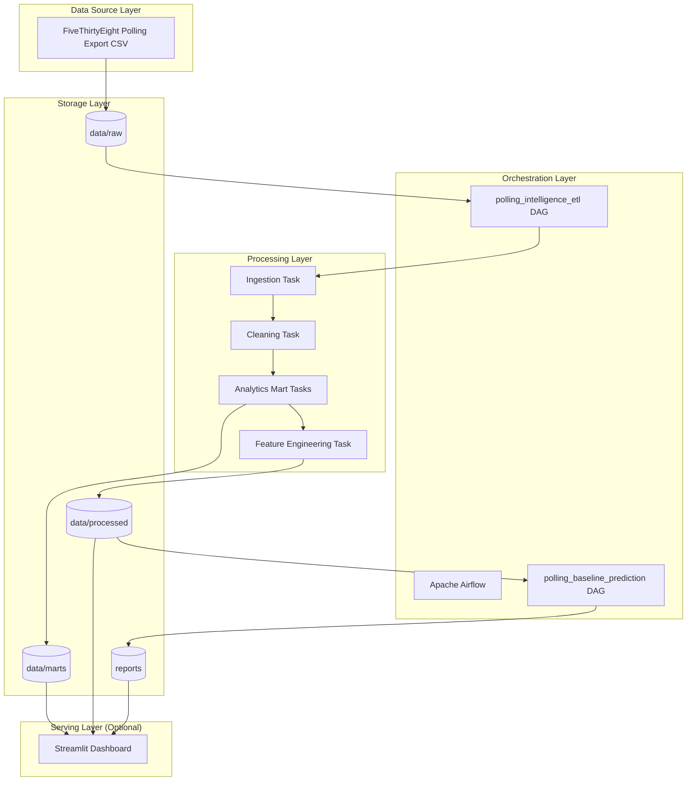
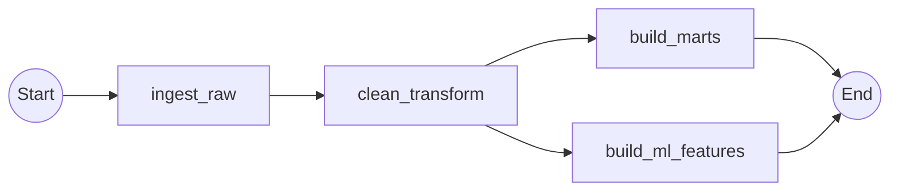
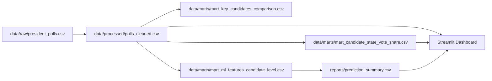

# Airflow-Orchestrated Polling Intelligence Pipeline
## Production-Style Batch ETL System (Apache Airflow + Python)

This project demonstrates a **Data Engineering pipeline orchestrated using Apache Airflow**.

The primary objective of this project is to showcase:

- Airflow DAG design
- Task orchestration and dependency management
- Modular ETL architecture
- Reproducible batch processing
- Data layer separation (Raw → Curated → Marts)
- Downstream artifact generation

The pipeline processes U.S. presidential polling data (FiveThirtyEight export snapshot) and produces structured analytical outputs and baseline prediction artifacts.

---

## 🚀 Core Focus: Apache Airflow

This project is intentionally built around **Airflow orchestration**.

All transformations and artifact generation are executed through Airflow DAGs.

Two DAGs are implemented:

1. **polling_intelligence_etl**
   - Ingestion
   - Cleaning & schema normalization
   - Analytics mart generation
   - ML-ready feature table creation

2. **polling_baseline_prediction**
   - Consumes cleaned dataset
   - Produces baseline aggregated prediction summary
   - Generates visualization artifact
   - Outputs prediction report

The DAGs were successfully executed and triggered via the Airflow UI.

---

## 🧱 System Architecture

### High-Level Architecture



---

### DAG Dependency Structure (ETL DAG)



---

### Data Lineage



---

## 📂 Repository Structure

```
├── dags/
│   ├── polling_etl_dag.py
│   └── election_prediction_dag.py
│
├── src/
│   ├── ingest.py
│   ├── transform.py
│   ├── analytics_marts.py
│   ├── feature_engineering.py
│   ├── prediction.py
│   └── paths.py
│
├── data/
│   ├── raw/
│   ├── processed/
│   └── marts/
│
├── reports/
│
├── dashboard/
│   └── streamlit_app.py
│
└── assets/
```

---

## 🔄 Pipeline Flow (Detailed)

### 1. Ingestion
- Reads raw polling CSV snapshot
- Validates schema presence
- Passes DataFrame to transformation layer

### 2. Cleaning & Standardization
- Date parsing
- Numeric coercion
- Null handling
- Column selection
- String normalization

Output:
```
data/processed/polls_cleaned.csv
```

### 3. Analytics Marts
- State-level candidate vote share
- Key candidate comparison
- Sample size variance
- Polling trends time-series
- Pollster transparency aggregation

Outputs saved under:
```
data/marts/
```

### 4. Feature Engineering (ML-Ready Table)
Aggregated per candidate/state:
- Mean vote %
- Variance
- Poll counts
- Mean sample size
- Transparency score
- Temporal range

Output:
```
data/marts/mart_ml_features_candidate_level.csv
```

### 5. Baseline Scoring DAG
- Aggregates mean polling %
- Produces ranked candidate summary
- Generates bar plot artifact
- Writes winner text output

Outputs:
```
reports/prediction_summary.csv
assets/candidates_probability_visualization.png
reports/winner.txt
```

---

## 🛠 Engineering Decisions

- Separation of concerns via modular `src/`
- No hardcoded system paths
- TaskFlow API for Airflow clarity
- Clear dependency ordering
- Layered storage design
- Idempotent batch design

---

## 🧠 Why This Matters for Data Engineering Roles

This project demonstrates:

- Real DAG construction
- Task grouping and dependency control
- Modular ETL architecture
- Data layer abstraction
- Artifact generation for downstream ML systems
- Production-style folder structuring
- Reproducible batch processing

Airflow orchestration is the central engineering skill highlighted here.

---

## ⚙️ Running the Project

### 1. Environment Setup

```bash
python -m venv .venv
.\.venv\Scripts\Activate.ps1   # Windows
pip install -r requirements.txt
```

### 2. Quick Local Execution (Without Airflow)

```bash
python run_local_once.py
```

### 3. Running via Airflow (Optional)

Set environment variables:

```powershell
$env:PIPELINE_ROOT = (Get-Location).Path
$env:AIRFLOW_HOME = "$pwd\airflow"
```

Initialize Airflow:

```powershell
airflow db init
airflow webserver -p 8080
airflow scheduler
```

Trigger DAGs in UI:
- polling_intelligence_etl
- polling_baseline_prediction

---

## 📈 Optional Dashboard

```bash
streamlit run dashboard/streamlit_app.py
```

The dashboard consumes outputs generated by Airflow.

---

## 🔮 Future Improvements (Designed but Not Implemented)

- Automated ingestion via API
- Data validation framework (Great Expectations)
- PostgreSQL data warehouse layer
- Dockerized deployment
- Scheduled retraining workflow
- CI/CD integration

---

## 📌 Summary

This project is an Airflow-centric batch ETL system designed to demonstrate:

✔ DAG orchestration  
✔ Modular pipeline design  
✔ Data layer separation  
✔ ML feature preparation  
✔ Artifact generation  
✔ Production-style structuring  

The core engineering focus is Apache Airflow orchestration and pipeline architecture.
